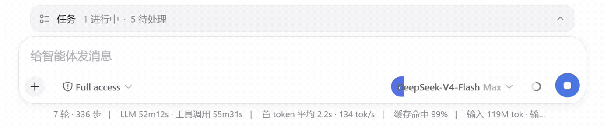

<div align="center">

# 🧠 dsh-thinkbar

**Dynamic reasoning-wait visual indicator for DeepSeek Harness Web Composer**

[](https://www.npmjs.com/package/dsh-thinkbar)
[](LICENSE)
[](https://github.com/deepseek-ai/deepseek-harness)
[](https://www.typescriptlang.org/)
[](https://nodejs.org)

<p align="center">
  <b>English</b> | <a href="README.zh.md">简体中文</a>
</p>

<br>



</div>

---

`dsh-thinkbar` is a lightweight, non-intrusive Web UI plugin for [DeepSeek Harness](https://github.com/deepseek-ai/deepseek-harness). It seamlessly fills the existing model selector with a dynamic thermal gradient while the visible assistant Step is streaming reasoning thoughts.

## ✨ Key Features

- 🌡️ **Thermal Iron Scale Palette**: Smooth transition from initial Harness info blue (0s) through red (~6.7s), orange (~13.3s), and glowing gold (20s) with an ease-out progression curve.
- ⚡ **Zero-Intrusion Portal Adapter**: Injects through the public `conversation.input.right` Slot lifecycle without hacking DSH internals, generated CSS classes, or model label strings.
- 🎯 **Accurate Stream State Machine**: Strictly tracks `reasoning` chunk boundaries. Direct text and tool-only calls never flash the indicator.
- 💨 **Fluid Drain Animation**: Drains smoothly in 240ms when reasoning yields to text, tool calls, or message completion.
- ♿ **Accessibility Ready**: Fully respects `prefers-reduced-motion` settings.
- 🔒 **100% Client-Side & Private**: Zero backend modifications, zero telemetry, zero external network traffic.

---

## 📋 Requirements

| Dependency | Required Version | Note |
| :--- | :--- | :--- |
| **DeepSeek Harness** | `0.1.2-alpha.1` (source build) | Supports exact source build target |
| **Profile** | Standard DSH `web` Profile | Official model-selection plugin enabled |
| **Node.js** | `^22.19.0` \|\| `>=24.0.0` | Recommended LTS |
| **Package Manager** | `pnpm` (>= 9.0) | Standard DSH workflow |

> [!IMPORTANT]
> This release supports exactly `0.1.2-alpha.1`. Earlier RCs used different Conversation service interfaces and are not supported.

---

## 🚀 Quick Start

### Installation

Install via npm registry:

```sh
pnpm dsh plugin --profile web add dsh-thinkbar
```

Or test a local release tarball:

```sh
pnpm dsh plugin --profile web add ./dsh-thinkbar-<version>.tgz
```

Restart your DSH Web Profile after installation:

```sh
pnpm dsh web
```

Verify that `dsh-thinkbar` is loaded:

```sh
pnpm dsh --profile web --dump-config
```
*(The output must contain exactly one `dsh-thinkbar` row)*

### Upgrade & Uninstall

```sh
# Upgrade to a specific version
pnpm dsh plugin --profile web add dsh-thinkbar@<version>

# Uninstall plugin
pnpm dsh plugin --profile web remove dsh-thinkbar
```

---

## 🔍 How It Works

```text
[ step/start ] ──> Record Clock Anchor (Idle)
       │
[ assistant/chunk: reasoning ] ──> Activate Fill (8% -> 100%, 0s -> 20s)
       │                              │
       │                              └──> Palette: Blue -> Red -> Orange -> Yellow
       │
[ text / tool-call / step/end ] ──> Fast Drain (240ms) -> Return to Idle
```

1. **State Projection**: Derives `{ waitOrigin, streamTime, active, tailKind }` from the public `ctx.uiConversation.events` and `ctx.uiConversation.views` registries.
2. **Anchor & Portal**: Anchors in `conversation.input.right`, identifies the trailing `button[aria-haspopup="menu"]` within `[data-composer-card]`, and portals an isolated plugin layer.
3. **Safety Fallback**: If the model trigger cannot be identified uniquely, the DOM remains untouched with a single console notice:
   ```text
   [dsh-thinkbar] Could not uniquely identify the DeepSeek Harness model selector; the indicator is disabled.
   ```

---

## 🛠️ Troubleshooting

| Issue | Root Cause | Solution |
| :--- | :--- | :--- |
| **No visual changes after install** | Profile not restarted or bundle unlinked | Restart Web Profile and verify with `pnpm dsh --profile web --dump-config`. |
| **Client bundle load failure** | DSH version mismatch | Ensure DSH source is `0.1.2-alpha.1`. Inspect browser console and host stderr. |
| **Compatibility warning in console** | Missing or conflicting model trigger | Ensure official model-selection plugin is enabled without conflicting custom buttons. |
| **Indicator does not light up** | Non-reasoning output | Indicator only triggers on reasoning streams; direct text or tool calls stay idle by design. |
| **Changes persist after removal** | Cached Profile process | Restart the Profile after `pnpm dsh plugin --profile web remove dsh-thinkbar`. |

---

## 🧑‍💻 Development

```sh
# Install dependencies
pnpm install --frozen-lockfile

# Run typecheck, unit tests, build validation & publint
pnpm verify

# Pack local tarball
pnpm pack
```

### Release Pipeline

```sh
# One-command automated publish suite
npm run publish

# Dry-run validation without publishing
npm run publish -- --dry-run
```

The browser artifact is a DSH lazy-CJS factory. Always preserve its `window.__ModuleLoader__.load(...)` envelope.

### Contributor References
- [Upstream-compatible reasoning indicator research](docs/research/upstream-reasoning-indicator.md)
- [DSH plugin publishing research](docs/research/dsh-plugin-publishing.md)

---

## 📄 License and Attribution

[MIT License](LICENSE)

The original reasoning indicator design was extracted from DeepSeek Harness commit `6d7ae5aa57b4dedfc03b09de7cafb65c01338800`. DeepSeek Harness is Copyright (c) 2026 DeepSeek and distributed under the MIT License. Independent packaging and subsequent modifications are maintained by the `dsh-thinkbar` contributors.
